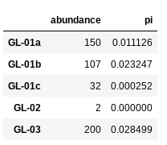
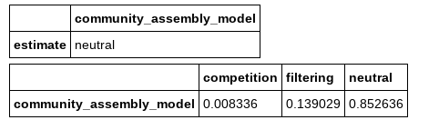
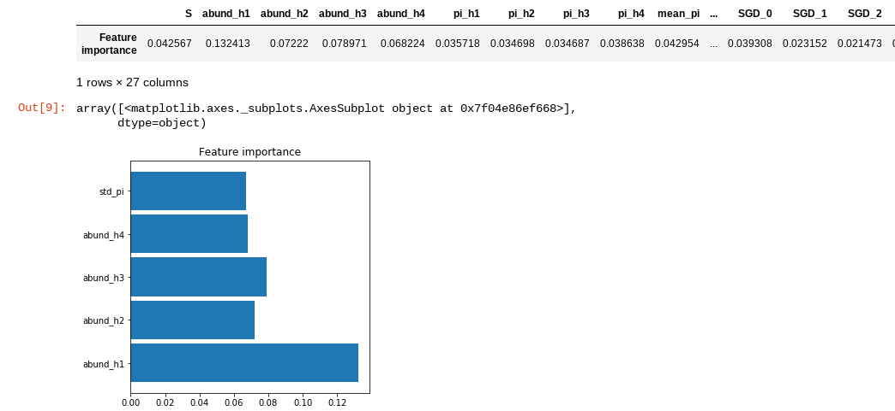
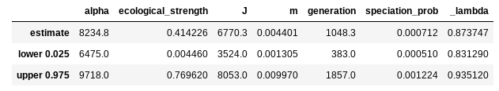
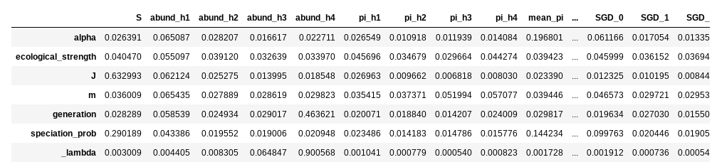
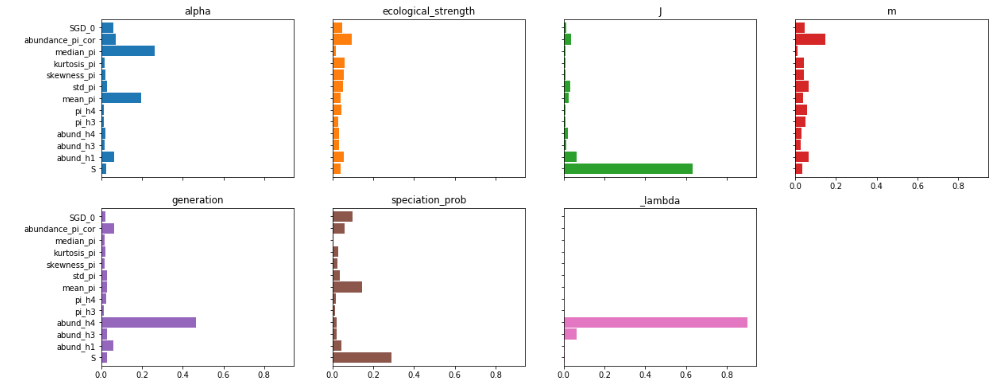
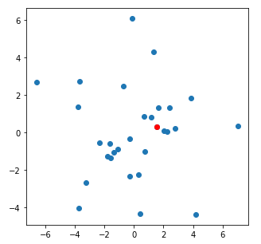
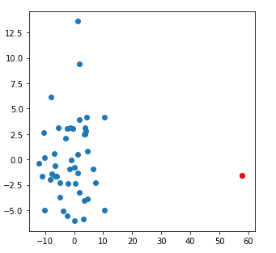

.. _ml_inference:

MESS Machine Learning (ML) Inference
====================================

Once you have performed a sufficient number of simulations you can now use
these simulations to perform community assembly model selection and
parameter estimation for observed community data. In this short tutorial
we will demonstrate the fundamentals of how this works.

The ``MESS.inference`` architecture is based on the powerful and
extensive `scikit-learn <https://scikit-learn.org/>`_ python machine
learning library. Another really amazing resource I highly recommend is
the `Python Data Science Handbook
<https://jakevdp.github.io/PythonDataScienceHandbook/>`_.

-  `Download and examine example empirical data`
-  `Fetch pre-baked simulations`
-  `Supported ensemble methods`
-  `ML assembly model classification`
-  `ML parameter estimation`
-  `Perform posterior predictive simulations`
-  `Experiment with other example datasets`

Download and examine example empirical data
-------------------------------------------
We will be using as an example dataset of community-scale COI sequences (~500bp)
and densely sampled abundances for the spider community on the island of La
Reunion, an overseas department of France, which is the largest of the Mascarene
islands, located in the Indian Ocean approximately 1000 km from Madagascar. The
data we will be using was collected and published by Emerson et al (2017). For
this exercise, we will just grab and use the formatted data from the MESS
github repository. For further instruction on properly formatting and converting
raw data into MESS-ready format see the `MESS raw data handling page
<MESS_process_raw_data.html>`_.

In a new cell in your notebook you can download the Reunion spider data
like this:

.. code:: bash

   !wget https://raw.githubusercontent.com/messDiv/MESS/master/empirical_data/Reunion_spiders/spider.dat

..

   **NB:** The ``!`` prior to the command here indicates that the
   jupyter notebook should interpret this as a bash command executed at
   the command line. This is a handy way of executing bash commands from
   within the notebook environment, rather than returning to a terminal
   window on the cluster. It's just a nice shortcut.

Now make a new cell and import MESS and pandas (which is a python
structured data library providing the DataFrame class), and read in the
data you just downloaded.

.. code:: python

   %matplotlib inline
   import MESS
   import pandas as pd
   spider_df = pd.read_csv("spider.dat", index_col=0)
   spider_df[:5]

..

   **Special Note:** The ``%matplotlib inline`` command tells jupyter to
   draw the figures actually inside your notebook environment. If you
   don't put this your figures won't show up!

   **NB:** Importing pandas as ``pd`` is pretty cannonical. It makes
   typing out pandas commands shorter because you can reference it as
   ``pd`` rather than ``pandas``.

   **NB:** The final line in the above command asks python to display
   the first 5 rows of the ``spider_df`` dataframe. It should look like
   this:

Fetch pre-baked simulations
---------------------------

Since it can take quite some time to run a number of simulations
sufficient for model selection and parameter estimation we will use a
suite of pre-baked simulations I generated ahead of time. Fetch them
with ``wget`` from the `compphylo site <https://compphylo.github.io/>`_:

::

   !wget https://compphylo.github.io/Oslo2019/MESS_files/MESS_simulations/SIMOUT.txt
   !wc -l SIMOUT.txt

::

   100%[======================================>] 14,234,338  50.0M/s   in 0.3s    
   2019-08-11 01:25:27 (50.0 MB/s) - "SIMOUT.txt.1" saved [14234338/14234338]
   24440 SIMOUT.txt

..

   **NB:** The ``wc`` command counts the number of lines if you pass it
   the ``-l`` flag. You can see this series of ~25k simulations is about
   14MB.

.. _ensemble_methods:

Supported ensemble methods
--------------------------
MESS currently supports three different ``scikit-learn`` ensemble methods for
classification and parameter estimation:

- RandomForest (`rf`):
- GradientBoosting (`gb`):
- AdaBoost (`ab`):

ML assembly model classification
--------------------------------

The first step is now to assess the model of community assembly that
best fits the data. The three models are ``neutral``, in which all
individuals are ecologically equivalent; ``competition``, in which
species have traits, and differential survival probability is weighted
by distance of traits from the trait mean in the local community (closer
to the trait mean == higher probability of death); and ``filtering``, in
which there is an environmental optimum, and proximity of trait values
to this optimum is positively correlated with survival probability.

Basically we want to know, are individuals in the local community
ecologically equivalent, and if not are, they interacting more with each
other or more with the local environment.

Here we create a ``MESS.inference.Classifier`` object and pass in the
empirical dataframe, the simulations, and specify RandomForest (``rf``) as
the algorithm to use (other options are GradientBoosting (``gb``) and
AdaBoost (``ab``)). Very thorough documentation of all the machine
learning inference architecture is available on the `MESS documentation
site <https://pymess.readthedocs.io/en/latest/api.html#inference-procedure>`__.

.. code:: python

   cla = MESS.inference.Classifier(empirical_df=spider_df, simfile="SIMOUT.txt", algorithm="rf")
   est, proba = cla.predict(select_features=False, param_search=False, quick=True, verbose=True)

The ``Classifier.predict()`` method provides a very sophisticated suite
of routines for automating machine learning performance tuning. Here we
disable **all** of this in order for it to run quickly, trading
accuracy for performance. The ``select_features`` argument controls
whether or not to prune summary statistics based on correlation and
informativeness. The ``param_search`` argument controls whether or not
to exhaustively search the space of parameters to maximize accuracy of
the ML algorithm selected. Finally, the ``quick`` argument subsets the
size of the simulation database to 1000 simulations, again as a means of
running quickly to check framework behavior. In normal conditions, when you
want to investigate real data you should use ``select_featers=True,
param_search=True, quick=False``. This will result in much more accurate
inference, yet will take *much* more time to run.

The call to ``cla.predict()`` returns both the most likely community
assembly model (``est``) and the model probabilities (``proba``), which
you can view:

.. code:: python

   from IPython.display import display
   display(est, proba)

..

   **NB:** The first line of this codeblock imports the ``display``
   method from the ``IPython`` library, which just makes pd.DataFrames
   pretty print.

Here we see that the ``neutral`` model is vastly favored over the
``competition`` and ``fitering`` models.

Now we can examine the weight of importance of each feature, an
indication of the contribution of each summary statistic to the
inference of the ML algorithm. You can also get a quick and dirty plot
of feature importances directly from the ``Classifier`` object with the
``plot_feature_importances()`` method.

.. code:: python

   display(cla.feature_importances())
   cla.plot_feature_importance(figsize=(5,5))

..

   **NB:** The ``figsize`` argument controls the size of the output
   figure. The default is ``(10, 10)``, so here we just make it a bit
   smaller to fit better in the notebook window.

The ``plot_feature_importance()`` method prunes out all the summary
statistics that contribute less than 5% of information to the final
model. This method is simply for visualization. Here you can see that
the shape of the abundance distributions (as quantified by the first 4
hill numbers) and the standard deviation of nucleotide diversity (pi)
within the local community are the most important summary statistics for
differentiating between the different community assembly models.

ML parameter estimation
-----------------------

Now that we have identified the neutral model as the most probable, we
can estimate parameters of the emipirical data given this model.
Essentially, we are asking the question "What are the parameters of the
model that generate summary statistics most similar to those of the
empirical data?"

The ``MESS.inference`` module provides the ``Regressor`` class, which
has a very similar API to the ``Classifier``. We create a ``Regressor``
and pass in the empirical data, the simulations, and the machine
learning algorithm to use, but this time we also add the
``target_model`` which prunes the simulations to include only those of
the community assembly model of interest. Again, we call ``predict()``
on the regressor and pass in all the arguments to make it run fast, but
do a bad job.

.. code:: python

   rgr = MESS.inference.Regressor(empirical_df=spider_df, simfile="SIMOUT.txt", target_model="neutral", algorithm="rfq")
   est = rgr.predict(select_features=False, param_search=False, quick=True, verbose=False)

..

   **NB:** Note that here we ask for the ``rfq`` algorithm, which
   designates random forest quantile regression, and allows for
   constructing prediction intervals, something the stock ``rf``
   algorithm doesn't do. The gradient boosting method (``gb``) provides
   prediction intervals natively.

The return value ``est`` is a dataframe that contains predicted values
for each model parameter and 95% prediction intervals, which are
conceptually in the same ball park as maximum likelihood confidence intervals
(CI) and and Bayesian highest posterior densities (HPD).

.. code:: python

   display(est)

Similar to the classifier, you can also extract feature importances from
the regressor, to get an idea about how each feature is contributing to
parameter estimation. In this case, the feature importance plots are a
little more useful than the giant table. Also note that we're requesting
a slighly larger figure, because this time there will be much more
information.

.. code:: python

   display(rgr.feature_importances())
   rgr.plot_feature_importance(figsize=(20,8))

You can see that some parameters are strongly driven by one or a couple
of features, and for some the feature importances are more diffuse. For
example species richness (``S``) contributes overwhelmingly to
estimation of local community size (``J``), which makes sense. On the
other hand, many more factors seem to contribute equally to estimation
of migration rate (``m``).

Perform posterior predictive simulations
----------------------------------------

Finally, a very important step in machine learning inference is to
validate the parameter estimates by performing posterior predictive
checks (PPCs). The logic of this procedure is that we will generate a
suite of simulations using our most probable parameter estimates, and
compare these simulations to our empirical data. For our purposes here
we will project the summary statistics of observed and simulated
datasets into principle component space. If the parameter estimates are
a good fit to the data then our posterior predictive simulations will
cluster together with the real data, whereas if the parameter estimates
are a poor fit, then the real data will be quite different from the
simulations.

**Spoiler alert:** Posterior predictive simulations can take quite a
while to run. With the parameters we get even with this toy data a
reasonable number of sims could take a couple hours. **So!** For the
purpose of this exercise we are going to *munge* the estimates to make
the simulations run faster. **DO NOT DO THIS WITH YOUR REAL DATA!**

.. code:: python

   est["J"] /= 2
   est["m"] *= 10
   est["_lambda"] /= 2
   est

Here we reduced the size of the local community (``J``), increased the
rate of migration (``m``), and decreased the duration of the simulation
(``_lambda``). All these things will make the simulations run more
quickly. Now go ahead and run this next cell, it should take one to two
minutes.

.. code:: python

   MESS.inference.posterior_predictive_check(empirical_df=spider_df,
                                             parameter_estimates=est,
                                             est_only=True,
                                             nsims=20,
                                             verbose=True,
                                             force=True)

::

     [#                   ]   5% Performing simulations

..

   **NB:** The ``posterior_predictive_check()`` function can also accept
   an ``ipyclient`` parameter to specify to use an ipyparallel backend.
   For simplicity here we will not use this option, but in reality it
   would be a good idea to parallelize the posterior predictive
   simulations. See the :ref:`MESS parallelization docs
   <arallelization.md>` for more info about how to implement the parallel
    backend.

This time the only thing we *have* to pass in is the empirical data and
the dataframe of prediction values, but I'm showing a couple more
arguments here for the sake of completeness. Setting ``est_only`` to
``True`` will use only the exact parameter estimates for all simulations,
whereas setting it to ``False`` will sample uniformly between the upper and
lower prediction interval for each simulation. ``nsims`` should be
obvious, the number of posterior predictive simulations to perform.
``force`` will overwrite any pre-existing simulations, thus preventing
mixing apples with oranges from different simulation runs. On the other
hand if this is ``False`` (the default), then this is a handy way to add
more PPCs to your analysis.

Here is a pretty typical example of a good fit of parameters to the
data:

And here is a nice example of a poor fit of parameters to the data:

Quite a striking, and obvious difference.

Experiment with other example datasets
--------------------------------------

Now you may wish to experiment  with some of the other empirical datasets
which are provided on the `MESS github repo
<https://github.com/messDiv/MESS/tree/master/jupyter-notebooks/empirical>`_,
or with exploring the substantial `MESS inference procedure API
documentation <https://pymess.readthedocs.io/en/latest/api.html#inference-procedure>`_
where we show a ton of other cool stuff MESS is capable of that we just
don't have time to go over in this short tutorial.

References
----------
::

    Emerson, B. C., Casquet, J., López, H., Cardoso, P., Borges, P. A.,
        Mollaret, N., … & Thébaud, C. (2017). A combined field survey and
        molecular identification protocol for comparing forest arthropod
        biodiversity across spatial scales. Molecular ecology resources, 17(4),
        694-707.

.. toctree::
    :hidden:

    API Parallelization  <MESS_parallelization.rst>
    Process Raw Data for Analysis <MESS_process_raw_data.rst>

Model Selection
---------------

Parameter Estimation
--------------------
