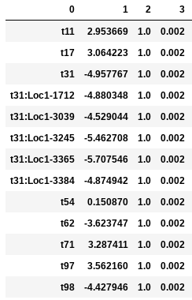
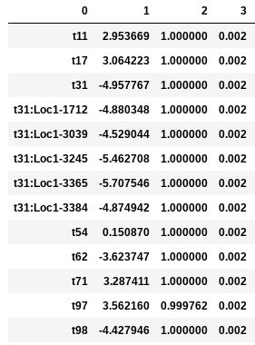
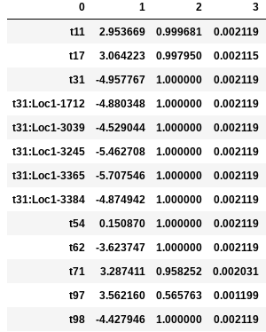
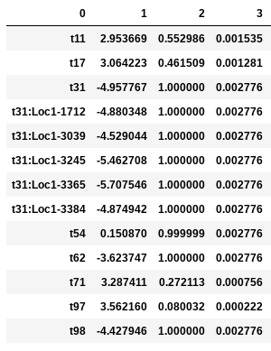
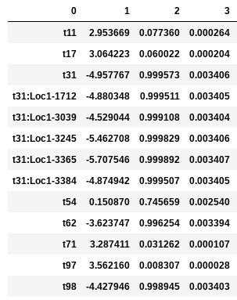
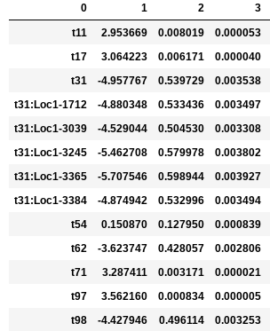

.. _parameters:

MESS Model Parameters
=============================
The parameters contained in a params file affect the behavior of various parts
of the forward-time and backward-time assembly process. The defaults that we 
chose are fairly reasonable values as as starting point, however, you will 
always need to modify at least a few of them (for example, to indicate the 
location of your data), and often times you will want to modify many of the 
parameters.

Below is an explanation of each parameter setting, the eco-evolutionary process
that it affects, and example entries for the parameter into a params.txt file.

.. _simulation_name:

simulation_name
---------------
The simulation name is used as the prefix for all output files. It should be a
unique identifier for this particular set of simulations, meaning the set of 
parameters you are using for the current data set. When I run multiple related
simulations I usually use names indicating the specific parameter combinations 
(e.g., filtering_nospeciation, J5000_neutral). 

Example: New community simulations are created with the -n options to MESS::

    ## create a new assembly named J1000_neutral
    $ MESS -n J1000_neutral          

.. _project_dir:

project_dir
-----------
A project directory can be used to group together multiple related simulations.
A new directory will be created at the given path if it does not already exist.
A good name for project_dir will generally be the name of the community/system being 
studied. The project dir path should generally not be changed after simulations/analysis
are initiated, unless the entire directory is moved to a different location/machine.

Example entries into params.txt::

    /home/watdo/MESS/galapagos         ## [1] create/use project dir called galapagos
    galapagos                          ## [1] create/use project dir called galapagos in cwd (./)

.. _generations:

generations
-----------
This parameter specifies the amount of time to run forward-time simulations. 
It can be specified in a number of different ways, but overall time can be 
considered either in terms of Wright-Fisher (WF) generations or in terms of Lambda.
For WF generations you should specify an integer value (or a range of integer values)
which will run the forward-time process for WF * J / 2 time-steps (where a time-step
is one birth/death/colonization/speciation event). For Lambda you may select
either an exact Lambda value (a real value between 0 and 1 exclusive), or you
can set `generations` equal to 0, which will draw random Lambda values between
0 and 1 for each simulation.

Example entries into params.txt::

    0                   ## [2] [generations]: Sample random Lambda values for each simulation 
    100                 ## [2] [generations]: Run each simulation for 100 WF generations
    50-100              ## [2] [generations]: Sample uniform between 50-100 WF generations for each simulation

.. _community_assembly_model:

community_assembly_model
------------------------
With this parameter you may specify a neutral or non-neutral scenario for
the forward time process. There are currently three different options for
this parameter: `neutral`, `filtering`, or `competition`. The `neutral`
case indicates full ecological equivalence of all species, so all
individuals have an equal probability of death at each time-step. In the
`filtering` and `competition` models survival probability is contingent
on proximity of species trait values to the environmental optimum, or distance
from the local trait mean, respectively. You may also use the wildcard `*`
here and MESS will randomly sample one community assembly model for each
simulation.

Example entries into params.txt::

    neutral             ## [3] [community_assembly_model]: Select the neutral process forward-time
    filtering           ## [3] [community_assembly_model]: Select the environmental filtering process
    *                   ## [3] [community_assembly_model]: Randomly choose one of the community assembly models

.. _speciation_model:

speciation_model
----------------

Specify a speciation process in the local community. If `none` then no
speciation happens locally. If `point_mutation` then one individual
will instantaneously speciate at rate `speciation_prob` for each forward-time
step. If `random_fission` then one lineage will randomly split into
two lineages at rate `speciation_prob` with the new lineage receiving
`n = U~(1, local species abundance)` individuals, and the parent lineage 
receiving `1 - n` individuals. `protracted` will specify a model of
protracted speciation, but this is as yet unimplemented.

Example entries into params.txt::

    none                ## [4] [speciation_model]: No speciation in the local community
    point_mutation      ## [4] [speciation_model]: Point mutation specation process

.. _mutation_rate:

mutation_rate
-------------
Specify the mutation rate for backward-time coalescent simulation of
genetic variation. This rate is the per base, per generation probability
of a mutation under an infinite sites model.

Example entries into params.txt::

    2.2e-08             ## [5] [mutation_rate]: Mutation rate scaled per base per generation

.. _alpha:

alpha
-----
Scaling factor for transforming number of demes to number of individuals.
``alpha`` can be specified as either a single integer value or as a range
of values.

Example entries to params.txt file::

    2000                ## [6] [alpha]: Abundance/Ne scaling factor
    1000-10000          ## [6] [alpha]: Abundance/Ne scaling factor

.. _sequence_length:

sequence_length
---------------
Length of the sequence to simulate in the backward-time process under
an infinite sites model. This value should be specified based on the
length of the region sequenced for the observed community data in bp.

Example entries to params.txt file::

    570                 ## [7] [sequence_length]: Length in bases of the sequence to simulate

.. _S_m:

S_m
---
S_m specifies the total number of species to simulate in the metacommunity. Larger
values will result in more singletons in the local community and reduced rates
of multiple-colonization.

Example entries to params.txt file::

    500                 ## [0] [S_m]: Number of species in the regional pool
    100-1000            ## [0] [S_m]: Number of species in the regional pool

.. _J_m:

J_m
---
The total number of individuals in the metacommunity.

Example entries to params.txt::

    0                  ## [9] allow zero low quality bases in a read
    5                  ## [9] allow up to five low quality bases in a read

.. _speciation_rate:

speciation_rate
---------------

Example entries to params.txt::

    2                  ## [2] [speciation_rate]: Speciation rate of metacommunity

.. _death_proportion:

death_proportion
----------------

Example entries to params.txt::

    0.7                ## [3] [death_proportion]: Proportion of speciation rate to be extinction rate

.. _trait_rate_meta:

trait_rate_meta
---------------

Example entries to params.txt::

    2                  ## [4] [trait_rate_meta]: Trait evolution rate parameter for metacommunity

.. _ecological_strength:

ecological_strength
-------------------
This parameter dictates the strength of interactions in the environmental
filtering and competition models. As the value of this parameter approaches
zero, ecological strength is reduced and the assembly process increasingly
resembles neutrality (ecological equivalence). Larger values increasingly
bias probability of death against individuals with traits farther from 
the environmental optimum (in the filtering model).

In the following examples the environmental optimum is `3.850979`, and the 
ecological strength is varied from 0.001 to 100. Column 0 is species ID,
column 1 is trait value, column 2 is unscaled probability of death, and
column 3 is proportional probability of death. Models with strength of
0.001 and 0.01 are essentially neutral. Strength of 0.1 confers a slight 
advantage to individuals very close to the local optimum (e.g. species 't97').

Ecological strength of 1 (below, left panel) is noticeably non-neutral (e.g. 't97' 
survival probability is 10x greater than average). A value of 10 for this 
parameter generates a _strong_ non-neutral process (below, center panel: 't97' is 100x less 
likely to die than average, and the distribution of death probabilities is
more varied). Ecological strength values >> 10 are _extreme_ and will probably
result in degenerate behavior (e.g. strength of 100 (below, right panel) in which
several of the species will be effectively immortal, with survival probability
thousands of times better than average).

Example entries to params.txt::

    1                  ## [5] [ecological_strength]: Strength of community assembly process on phenotypic change
    0.001-1            ## [5] [ecological_strength]: Strength of community assembly process on phenotypic change

.. _name:

name
----

Example entries to params.txt::

    island1            ## [0] [name]: Local community name

.. _J:

J 
--

Example entries to params.txt::

    1000-2000          ## [1] [J]: Number of individuals in the local community

.. _m:

m 
--

Example entries to params.txt::

    0.01               ## [2] [m]: Migration rate into local community

.. _speciation_prob:

speciation_prob
---------------

Example entries to params.txt::

    0                  ## [3] [speciation_prob]: Probability of speciation per timestep in local community
    0.0001-0.001       ## [3] [speciation_prob]: Probability of speciation per timestep in local community
