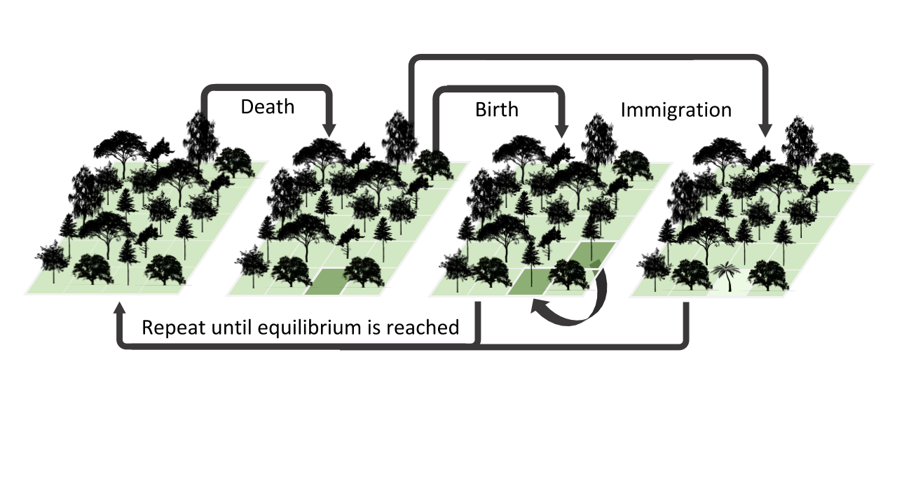

.. _tutorial_cli:

MESS (Massive Eco-Evolutionary Synthesis Simulations) - Part I
==============================================================

This is the first part of the full tutorial for the command line
interface (**CLI**) for MESS. In this tutorial we’ll walk through the
entire simulation and analysis process. This is meant as a broad
introduction to familiarize users with the general workflow, and some of
the parameters and terminology. We will use as an example in this
tutorial the spider community data set from La Reunion published by
Emerson et al (2017). However, you can follow along with one of the
`other example
datasets <https://github.com/messDiv/MESS/tree/master/jupyter-notebooks/empirical>`__
if you like, the procedure will be identical although your results will
vary.

MESS Part I Outline
-------------------

-  `Equilibrium theory of island biogeography and neutral theory
   (individual based simulations) <#ETIB-NTIB-Intro>`__
-  `Overview of MESS Simulations <#MESS-Overview>`__
-  `Installation <#Installation>`__
-  `TL;DR Run your first simulations <#TLDR-Simulations>`__
-  `Getting started with the MESS CLI <#MESS-CLI-intro>`__
-  `Create and edit a new params file <#Create-Params-File>`__
-  `Run simulations using your edited params file <#Simulate>`__
-  `Inspect the output of the simulation runs <#Inspect-Simulations>`__
-  `Setting prior ranges on parameters <#Prior-Ranges>`__

Each grey cell in this tutorial indicates a command line interaction.
Lines starting with ``$`` indicate a command that should be executed in
a terminal connected to the cluster, for example by copying and pasting
the text into your terminal. Elements in code cells surrounded by angle
brackets (e.g. ) are variables that need to be replaced by the user. All
lines in code cells beginning with ## are comments and should not be
copied and executed. All other lines should be interpreted as output
from the issued commands.

.. code:: bash

   ## Example Code Cell.
   ## Create an empty file in my home directory called `watdo.txt`
   $ touch ~/watdo.txt

   ## Print "wat" to the screen
   $ echo "wat"
   wat

Equilibrium theory of island biogeography and neutral theory
------------------------------------------------------------
`Background and a brief introduction to the MESS
model. <https://docs.google.com/presentation/d/1dbQOZ17RliFyRBzyLdDDn3SWCmaWwXcVD2h1muyixv8/edit?usp=sharing>`__

 ## Overview of MESS simulation and analysis workflow

The basic steps of this process are as follows:

-  Step 1 - Set parameters based on prior knowledge of empirical system
-  Step 2 - Run mega simulations
-  Step 3 - Use ML to infer community assembly process
   (neutral/competition/filtering)
-  Setp 4 - Use ML to estimate key community assembly parameters
-  Step 5 - ???
-  Step 6 - Profit!!

MESS is distributed as a conda package so installation is simple and and
straightforward. If you don’t already have conda installed, `do the
conda install
first. <https://compphylo.github.io/Oslo2019/UiO_Cluster_info.html#conda-install>`__

::

   ## Install MESS using conda
   $ conda install -c conda-forge -c mess mess

**TL;DR:** Just show me how to do the simulations! Say you’re impatient
and want to skip right to the good stuff, well here you go.

::

   ## Get an interactive session on the cluster
   bash qlogin.sh
   ## Create a parameters file
   MESS -n new-sims
   ## Do 10 simulations using the default settings and 4 cores
   MESS -p params-new-sims.txt -s 10 -c 4

Getting started with the MESS CLI
---------------------------------
First, we need to get ourselves an
interactive session in the proper conda environment on the cluster, so
before going any farther run your ``qlogin.sh`` script, and activate
your environment when it fires up:

.. code:: bash

   $ cd ~
   $ bash qlogin.sh
   $ conda activate CompPhylo_1

Once this finishes you’ll be sitting at a command line on one of the
cluster compute nodes. This way any simulations you run will run on the
cluster rather than on the login node (makes the admins happier).

To better understand how to use MESS, let’s take a look at the ``help``
argument. We will use some of the MESS command line arguments in this
tutorial (for example: -n, -p, -s, -c). The complete list of optional
arguments and their explanation can be accessed with the ``--help``
flag:

::

   $ MESS -h
   usage: MESS [-h] [-n new] [-p params] [-s sims] [-c cores] [-r] [-e empirical]
               [-f] [-q] [-Q] [-d] [-l] [--ipcluster [ipcluster]] [--fancy-plots]

   optional arguments:
     -h, --help            show this help message and exit
     -n new                create new file 'params-{new}.txt' in current
                           directory
     -p params             path to params file simulations: params-{name}.txt
     -s sims               Generate specified number of simulations
     -c cores              number of CPU cores to use (Default=0=All)
     -r                    show status of this simulation run
     -e empirical          Validate and import empirical data.
     -f                    force overwrite of existing data
     -q                    do not print to stderror or stdout.
     -Q                    do not print anything ever.
     -d                    print lots more info to mess_log.txt.
     -l                    Write out lots of information in one directory per
                           simulation.
     --ipcluster [ipcluster]
                           connect to ipcluster profile
     --fancy-plots         Construct fancy plots and animated gifs.

     * Example command-line usage:
       MESS -n data                       ## create new file called params-data.txt
       MESS -p params-data.txt            ## run MESS with settings in params file
       MESS -p params-data.txt -f         ## run MESS, overwrite existing data.

Create a new parameters file
----------------------------
MESS uses a text file to hold all the
parameters for a given community assembly scenario. Start by creating a
new parameters file with the ``-n`` flag. This flag requires you to pass
in a name for your simulations. In the example we use ``simdata`` but
the name can be anything at all. Once you start analysing your own data
you might call your parameters file something more informative, like the
name of your target community and some details on the settings.

.. code:: bash

   $ cd ~
   $ mkdir MESS 
   $ cd MESS

   # Create a new params file named 'simdata'
   $ MESS -n simdata

This will create a file in the current directory called
``params-simdata.txt``. The params file lists on each line one parameter
followed by a ## mark, then the name of the parameter, and then a short
description of its purpose. Lets take a look at it.

::

   $ cat params-simdata.txt
   ------- MESS params file (v.0.1.0)---------------------------------------------
   simdata              ## [0] [simulation_name]: The name of this simulation scenario
   ./default_MESS       ## [1] [project_dir]: Where to save files
   0                    ## [2] [generations]: Duration of simulations. Values/ranges Int for generations, or float [0-1] for lambda.
   neutral              ## [3] [community_assembly_model]: Model of Community Assembly: neutral, filtering, competition
   point_mutation       ## [4] [speciation_model]: Type of speciation process: none, point_mutation, protracted, random_fission
   2.2e-08              ## [5] [mutation_rate]: Mutation rate scaled per base per generation
   2000                 ## [6] [alpha]: Abundance/Ne scaling factor
   570                  ## [7] [sequence_length]: Length in bases of the sequence to simulate
   ------- Metacommunity params: --------------------------------------------------
   100                  ## [0] [S_m]: Number of species in the regional pool
   750000               ## [1] [J_m]: Total # of individuals in the regional pool
   2                    ## [2] [speciation_rate]: Speciation rate of metacommunity
   0.7                  ## [3] [death_proportion]: Proportion of speciation rate to be extinction rate
   2                    ## [4] [trait_rate_meta]: Trait evolution rate parameter for metacommunity
   1                    ## [5] [ecological_strength]: Strength of community assembly process on phenotypic change
   ------- LocalCommunity params: island1------------------------------------------
   island1              ## [0] [name]: Local community name
   1000                 ## [1] [J]: Number of individuals in the local community
   0.01                 ## [2] [m]: Migration rate into local community
   0                    ## [3] [speciation_prob]: Probability of speciation per timestep in local community

..

   **Note:** What’s the difference between a CLI argument and a MESS
   params file parameter, you may be asking yourself? Well, MESS CLI
   arguments specify how the simulations are performed (e.g. how many to
   run, how many cores to use, whether to print debugging information,
   etc), whereas MESS params file parameters dictate the structure of
   the simulations to run (e.g. sizes of communities, migration rates,
   specation rates, etc).

The defaults are all values of moderate size that will generate ‘normal’
looking simulations, and we won’t **mess** with them for now, but lets
just change a couple parameters to get the hang of it. Why don’t we
change the ``name`` parameter of the local community, “island1” is so
generic!. Pick your favorite island and change the name to this. Let’s
also set ``J`` (size of the local community in individuals) equal to 500
as this will speed up the simulations (smaller local communities reach
equilibrium faster).

We will use the ``nano`` text editor to modify ``params-simdata.txt``
and change this parameter:

.. code:: bash

   $ nano params-simdata.txt

Nano is a command line editor, so you’ll need to use only the arrow keys
on the keyboard for navigating around the file. Nano accepts a few
special keyboard commands for doing things other than modifying text,
and it lists these on the bottom of the frame. After you are done making
the changes your file will now have lines that look like this:

.. code:: bash

   La_Reunion ## [0] [name]: Local community name
   500                 ## [1] [J]: Number of individuals in the local community

..

   **Note:** For scientific computing, in almost all cases spaces in
   variable names and labels should be considered **harmful**. Notice
   here how I replace the space in “La Reunion” with an underscore
   (“\_”) character, this is common practice that you should adopt.

After you change this parameters you may save and exit nano by typing
CTRL+o (to write **O**\ utput), and then CTRL+x (to e\ **X**\ it the
program).

   **Note:** The ``CTRL+x`` notation indicates that you should hold down
   the control key (which is often styled ‘ctrl’ on the keyboard) and
   then push ‘x’.

Once we start running the simulations and performing MESS analyses all
the temp files and directories it needs are created in the
``project_dir`` directory and use the prefix specified by the
``simulation_name`` parameter. Because we use the default
(``./default_MESS``) for the ``project_dir`` for this tutorial, all
these intermediate directories will be of the form:
``~/MESS/default_MESS/simdata_*``, or the analagous name that you used
for your assembly name.

   **Note on files in the project directory:** MESS relies on the
   integrity of the ``project_directory`` for keeping track of various
   temporary files used by the simulation/analysis process. One result
   of this is that you can have multiple simulations of the same
   community assembly scenario using different parameter settings and
   you don’t have to manage all the files yourself! Another result is
   that **you should not rename or move any of the files or directories
   inside your project directory**, unless you know what you’re doing or
   you don’t mind if your simulations/analyses break.

 ## Run simulations using your edited params file

   **Special Note:** In command line mode please be aware to *always*
   specify the number of cores with the ``-c`` flag. If you do not
   specify the number of cores MESS assumes you want only one of them,
   which will result in painfully slow simulation runs (serial
   processing).

.. code:: bash

   ## -p    the params file we wish to use
   ## -s    the number of simulations to perform
   ## -c    the number of cores to allocate   <-- Important!
   $ MESS -p params-simdata.txt -s 10 -c 4
    -------------------------------------------------------------
     MESS [v.0.1.0]
     Massive Eco-Evolutionary Synthesis Simulations
    -------------------------------------------------------------
     Project directory exists. Additional simulations will be appended.

       <MESS.Region simdata: ['La_Reunion']>
     establishing parallel connection:
     host compute node: [4 cores] on goatzilla
       Generating 10 simulation(s).
     [####################] 100%  Performing Simulations    | 0:00:46 | 
     [####################] 100% 
       Finished 10 simulations
    Clean up ipcluster <ipyparallel.client.client.Client object at 0x7f15cc3c9090>

..

   **Note:** You can see here that MESS is intelligently handling all
   the parallelization work for you. You tell it how many cores to use
   with the ``-c`` flag and it portions out simulations among all the
   cores as they become available.

 ## Inspect the output of the simulation runs

Simulation parameters and summary statistics are written to the
``SIMOUT.txt`` file. You can check the length of this file.

.. code:: bash

   $ wc -l default_MESS/SIMOUT.txt 
   11 default_MESS/SIMOUT.txt

   # Use `less` to look inside the file. Use `q` to quit less when you are done.
   less default_MESS/SIMOUT.txt

..

   **NB:** Lines in this file are very long, so less will wrap the text
   by default. Turn of line wrapping by typing ``-S`` then pushing .

::

   S_m     J_m     speciation_rate death_proportion        trait_rate_meta ecological_strength     generations     community_assembly_model
   100     750000  2.0     0.7     2.0     1.0     0.0     neutral point_mutation  0.0     2000    570.0   500.0   0.01    0.0     189.0   0.696
   100     750000  2.0     0.7     2.0     1.0     0.0     neutral point_mutation  0.0     2000    570.0   500.0   0.01    0.0     43.0    0.238

 ## Setting prior ranges on parameters

Rather than explicitly specifying MESS parameters, let’s say you’re
interested in actually estimating them from the observed data. We can do
this by simulating over a range of values for each parameter of
interest, and then using the MESS inference procedure to estimate these
paramters. Let’s say you would like to estimate the size of the local
community (``J``) and the migration rate into the local community
(``m``). Edit your params file again with ``nano``:

.. code:: bash

   nano params-simdata.txt

and change the following two parameter settings:

::

   1000-2000                 ## [1] [J]: Number of individuals in the local community
   0.001-0.01                 ## [2] [m]: Migration rate into local community

..

   **Note:** Saving and quitting from ``nano``: ``CTRL+o`` then
   ``CTRL+x``

Now run some more simulations (MESS will append these new simulations to
the SIMOUT file):

::

   $ MESS -p params-simdata.txt -s 10 -c 4
    -------------------------------------------------------------
     MESS [v.0.1.0]
     Massive Eco-Evolutionary Synthesis Simulations
    -------------------------------------------------------------
     Project directory exists. Additional simulations will be appended.

       <MESS.Region simdata: ['La_Reunion']>
     establishing parallel connection:
     host compute node: [4 cores] on goatzilla
       Generating 10 simulation(s).
     [####################] 100%  Performing Simulations    | 0:00:46 |
     [####################] 100%
       Finished 10 simulations
    Clean up ipcluster <ipyparallel.client.client.Client object at 0x7f15cc3c9090>

Let’s use ``cut`` to look at just the columns we’re interested in (``J``
and ``m``), which are the 13th and 14th columns.

.. code:: bash

   $ cut -f 13,14 default_MESS/SIMOUT.txt
   J       m
   500.0   0.01
   500.0   0.01
   500.0   0.01
   500.0   0.01
   500.0   0.01
   500.0   0.01
   500.0   0.01
   500.0   0.01
   500.0   0.01
   500.0   0.01
   1118.0  0.00205
   1168.0  0.00172
   1515.0  0.00323
   1061.0  0.0014
   1305.0  0.00859
   1434.0  0.00881
   1397.0  0.00706
   1096.0  0.00509
   1889.0  0.00112
   1699.0  0.00285

And you’ll see that these parameter values are now taking a range, as we
specified. In `MESS Part II <MESS_PartI.md>`__ you will see how we can
combine massive amounts of simulations under varying parameter ranges
with machine learning to estimate parameters of the model with real
data.
